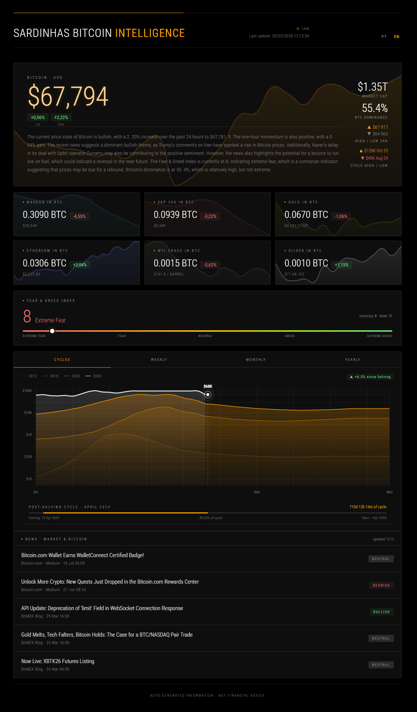

<!-- HEADER GRADIENT -->

<p align="center">
  
</p>

<p align="center">
  <strong>Minimal Bitcoin Intelligence Dashboard</strong><br/>
  <sub>Structure · Momentum · Context</sub>
</p>

---

<p align="center">
  <a href="https://sardinhas-bitcoin-int.onrender.com/">
    
  </a>
  
  
</p>

---

## 🚀 Live Application

👉 https://sardinhas-bitcoin-int.onrender.com/

---

## 📡 Preview

<p align="center">
  
</p>

---

## 🧠 Overview

SARDINHAS is a **lightweight Bitcoin intelligence layer** built for real decision-making.

No clutter.
No distractions.
Only signal.

---

## ⚡ Core Principles

* Minimal UI → faster cognition
* Data > opinions
* Context over indicators
* Bitcoin chart by **cycles**

---

## 🧩 Signals Engine

The system is designed around **multi-layer signal convergence**:

### 1. Trend Layer

* Moving Averages (dynamic cross analysis)
* Market structure (HH / HL / LH / LL)

### 2. Momentum Layer

* RSI (overbought / oversold zones)
* Velocity shifts (acceleration / deceleration)

### 3. Liquidity Layer *(planned expansion)*

* Order blocks
* Liquidity sweeps
* Imbalance zones

### 4. Context Layer

* Global macro alignment
* Bitcoin dominance
* External flows (derivatives / on-chain ready)

---

## 🔬 Philosophy Behind Signals

Instead of relying on isolated indicators:

> **Signals emerge from confluence, not single metrics**

The goal is to answer:

**“What is the most probable next move?”**

---

## 🛠 Stack

* Vanilla JavaScript
* Lightweight chart rendering
* External data sources
* Render (deployment)
* GitHub (versioning)

---

## 🧪 Local Setup

```bash
git clone https://github.com/nakmot0/SARDINHAS_bitcoin.INT.git
cd SARDINHAS_bitcoin.INT
```

Run locally:

```bash
python -m http.server 8000
```

Open:

```
http://localhost:8000
```

---

## 🛣 Roadmap

* Multi-timeframe engine
* Smart alerts system
* AI-assisted signal interpretation
* On-chain + derivatives integration
* Advanced liquidity mapping

---

## 🤝 Contributing

If you understand markets and code:

Fork → Build → PR

---

## ⚠️ Disclaimer

Not financial advice.
Use at your own risk.

---

<p align="center">
  <sub>Built for those who read the market differently.</sub>
</p>

<p align="center">
  
</p>
